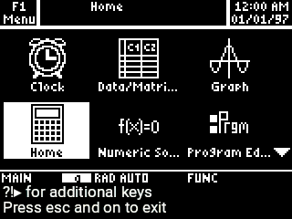

# n-89
TI 89 Titanium emulator for the Nspire

# Screenshots




# Getting an image file
For now, you'll need a complete TIEmu `.img` file. This can be obtained
in two ways: by downloading it from TI's website, or by dumping from a
physical calculator.

## Option 1: Downloading an image
You may either download it from [TI-Planet], or from [TI directly].
However, note that TI is now requiring you to fill out a form confirming
that you aren't using it for an emulator—even though that's exactly what
you're doing with it.

## Option 2: Dumping the ROM from a physical calculator
Alternatively, you may [download TiLP] and use it to dump the ROM from
a physical TI-89 calculator.

## Converting to a `.img` file
Now that you have your `.rom` or `.89u` file, you can use TIEmu on a
computer to convert it to a `.img` file. Start by [downloading TiEmu]
and starting it up. Select "You have downloaded a FLASH upgrade on the
TI website" if you have a `.89u` file or "You already have a ROM dump"
if you have a `.rom` file.

Now, go to the `images` folder created by TiEmu. On Linux, this is in
`~/.tiemu/images`. I don't know where it is on Windows, but from the
source code, it looks like it will be in the same directory as the exe
file. Take the `.img` file and rename it so that it ends with
`.img.tns`. Now, send that to the calculator, along with the
[latest version of n-89]. Finally, select that image when starting n-89.


[TI-Planet]: https://tiplanet.org/forum/archives_voir.php?id=1863
[TI directly]: https://education.ti.com/en/software/details/en/6633925F6176419197BF6CA051F5F7B4/89ti89tioperatingsystem
[download TiLP]: http://lpg.ticalc.org/prj_tilp/index.html
[downloading TiEmu]: http://lpg.ticalc.org/prj_tiemu/
[latest version of n-89]: https://github.com/lights0123/n-89/releases

# Usage Instructions
After selecting the location of your `.img` file, you will enter the
emulator. Press the ?:▶ button on your calculator to access the key
picker, allowing you to press any key available on the TI-89. Press the
menu key to access the quick function menu, where you can press F1-F8.
Press both On and Esc at the same time to exit.

# Roadmap
**Note that I currently have no plans to work on any of these (except
saving state), and this emulator is already good enough for my needs**.
However, I would be happy to work on additional features if people are
interested. **Please let me know if you would like to see any of these
features**.

- Direct ROM conversion without TiEmu: there are many issues with DLLs
  on Windows and several issues with building TiEmu on Linux. Either
  having a website with WebAssembly that runs the emulator or built into
  the calculator app would be useful.
- Saving state support: support for saving the RAM between launches.
  This would greatly speed up startup, and would allow installing
  additional apps and saving variables.
- Other m68k calculators: This may already be compatible with other
  Motorola 68000-based calculators. However, they are not tested.
- Other calculators: a TI-84 CE emulator would not be hard to get
  working.
- Faster emulator: if anyone would like to improve the TiEmu code or
  (preferably) port it to Rust, that would be extremely helpful. There
  have been no changes to TiEmu since 2007, and it likely can be
  optimized from there.

# Development
## Prerequisites
- Ndless toolchain installed and added to path
- gcc installed
- Rustup installed
- `jq`
- Unix-like (tested on Linux, most likely Mac and Cygwin will work as
  well)

To install Rust:
```bash
curl https://sh.rustup.rs -sSf | sh
```

## Building
Get started by running `make` to start development. Your .tns file will
be available as `n-89.tns`.

You can toggle debug mode by changing `DEBUG = FALSE` at the top of the
Makefile.
